# 🌌 IOI Career Excellence Platform: The Performance OS

[](https://ioi-leaderboard.vercel.app)
[](https://react.dev)
[](https://developer.mozilla.org/en-US/docs/Web/CSS)
[](https://vitejs.dev)

> **"Moving beyond spreadsheets into a high-fidelity performance ecosystem."**

The **IOI Career Excellence Platform** is a custom-engineered, mobile-first analytics and gamification system built to track, motivate, and accelerate student growth across all 4 PW Institute of Innovation centers. It bridges the gap between raw academic data and actionable strategic insights.

---

## 📽️ Live Platform Link
**Experience it here**: [https://ioi-leaderboard.vercel.app](https://ioi-leaderboard.vercel.app)

---

## 🏛️ System Ecosystem & Data Lifecycle

```mermaid
graph TD
    subgraph "Entry Layer"
        User((User)) -->|HTTPS/Vercel| UI[Liquid Glass UI]
        UI --> Auth{Role Scoping}
    end

    subgraph "Strategic Dashboards"
        Auth -->|Student| S_Hub[Growth Hub Dashboard]
        Auth -->|Faculty| F_Term[Scoring Terminal]
        Auth -->|Management| M_Apex[Strategy Apex View]
    end

    subgraph "Cognitive Data Engine"
        F_Term -->|Sync| DS[(Central Data Store)]
        S_Hub -->|Fetch| DS
        M_Apex -->|Aggregate| DS
        
        DS -->|Trigger| Game[Gamification Logic]
        Game -->|XP/Levels| Badges{Badge Wallet}
        Badges -->|Spotlight| HOF[Hall of Fame]
    end

    subgraph "Actionable Insights"
        DS -->|Analysis| RAG{RAG Status Enginge}
        RAG -->|Critical| Alerts[Faculty Intervention]
        RAG -->|Elite| PL[Placement Readiness]
    end

    style User fill:#6366f1,stroke:#fff,stroke-width:2px
    style DS fill:#1e1b4b,stroke:#6366f1,stroke-width:2px
    style Game fill:#7c3aed,stroke:#fff,stroke-width:2px
    style RAG fill:#ef4444,stroke:#fff,stroke-width:2px
```



---

## ✨ Key Modules

### 👤 1. The Student Growth Hub
*   **XP & Leveling**: Turning academic consistency into a RPG-like progression.
*   **Hall of Fame**: Monthly spotlights for top performers (Student of the Month).
*   **The Quest System**: Daily and weekly challenges to boost participation.
*   **Badge Wallet**: Digital certificates for soft skills, attendance, and leadership.

### 🍎 2. The Faculty Command Center
*   **Rapid Entry**: 30-second score injection for Attendance and Assessments.
*   **Early Warning System**: Automatic identification of "Red" status students.
*   **Nomination Center**: Direct portal for faculty to nominate students for Elite badges.

### 📊 3. Management Strategy Suite
*   **Multi-Center Benchmarking**: Compare performance between BLR, NOI, PUN, and LKO.
*   **Strategic Placement Readiness**: A predictive view of which students are ready for high-tier roles.
*   **Historical Trends**: 8-month historical tracking (Sept 2025 - April 2026).

---

## 🎨 Design Philosophy: "Liquid Glass"
The platform features a custom-built design system called **Liquid Glass**. It uses:
*   **Dynamic Saturation**: Backgrounds that shift colors based on the current school category (SOT, SOM, SOH).
*   **HSL Tokenization**: All colors are derived from HSL (Hue, Saturation, Lightness) variables for perfect accessibility in Dark Mode.
*   **Micro-Animations**: Framer-like CSS animations for "Slide-Up" page transitions and pulse glows.

---

## 🛠️ Tech Stack

| Layer | Technology |
| :--- | :--- |
| **Frontend** | React 18 (Hooks, Suspense) |
| **State** | Zustand (Global Data Store) |
| **Styling** | Vanilla CSS (Glassmorphism / CSS Variables) |
| **Charts** | Recharts (Responsive SVG engine) |
| **Icons** | Lucide React |
| **Build Tool** | Vite |
| **Deployment** | Vercel (Production Edge) |

---

## 📁 Directory Structure

```bash
src/
├── components/
│   ├── layout/       # AppShell, Sidebar, BottomNav
│   ├── ui/           # Logo, Badge, ProgressBar, CosmosPanel
│   └── common/       # Reusable atoms
├── data/
│   └── mockData.js   # The "Engine" — Centralized relational data
├── pages/
│   ├── student/      # Growth Hub, Leaderboard, Rewards
│   ├── faculty/      # Entry Terminal, Nomination Center
│   └── management/   # Strategy View, Judge Mode
├── store/
│   └── authStore.js  # Role-based state management
└── styles/
    └── index.css     # "Liquid Glass" token definitions
```

---

## 🚀 Getting Started

1. **Clone & Install**
   ```bash
   git clone https://github.com/raunitx-02/IOI-Career-Excellence-OS.git
   cd ioi-leaderboard
   npm install
   ```

2. **Run Dev Environment**
   ```bash
   npm run dev
   ```

3. **Build for Production**
   ```bash
   npm run build
   ```

---

## 👤 Author: Raunit Raj
> **Developer Insight**: This project was built entirely as a **solo initiative**. While initially framed as a team project, I took full ownership of the end-to-end architecture—from the design tokens to the data-scoping logic—to ensure the highest possible standard of quality and performance for the IOI ecosystem.

---

© 2026 PW Institute of Innovation · Leaderboard & Analytics Platform
