# 🌌 IOI Career Excellence Platform: The Performance OS

> **"A high-fidelity academic ecosystem designed for the next generation of industry leaders."**

The **IOI Career Excellence Platform** is a custom-engineered, mobile-first analytics and gamification system built to track, motivate, and accelerate student growth across all 4 PW Institute of Innovation centers. It bridges the gap between raw academic data and actionable strategic insights.

---

## 📽️ Live Platform & Demo Access
**Experience the live app here**: [https://ioi-leaderboard.vercel.app](https://ioi-leaderboard.vercel.app)

### 🔐 Demo Credentials (For Testing)
| Role | Email | Password | Access Level |
| :--- | :--- | :--- | :--- |
| **Management** | `management@pwioi.edu` | `mgmt123` | Global Strategic View |
| **Faculty** | `verma@noi.pwioi.edu` | `faculty123` | Center & School Scoped |
| **Student** | `aarav1@student.pwioi.edu`| `student123` | Personal Growth Hub |

---

## 🏛️ Project Architecture (Simplified)

```mermaid
graph LR
    subgraph "The Input"
        A[Student Actions]
        B[Faculty Scores]
    end

    subgraph "The Processing Core"
        Logic[Performance Engine]
        Data[(Central Data OS)]
    end

    subgraph "The Outcome"
        C[Global Leaderboards]
        D[RAG Risk Analysis]
        E[Placement Readiness]
    end

    A --> Logic
    B --> Logic
    Logic --> Data
    Data --> C
    Data --> D
    Data --> E

    style Data fill:#1e1b4b,stroke:#6366f1,stroke-width:2px
    style Logic fill:#6366f1,stroke:#fff,stroke-width:2px
```

---

## 📖 The "A to Z" Platform Encyclopedia

| Feature | Description |
| :--- | :--- |
| **A** | **Analytics & Authentication**: Role-based access with deep data-scoping. |
| **B** | **Badges & Battlegrounds**: Digital rewards for soft skills and event performance. |
| **C** | **Centers & Classrooms**: Multi-tenancy support for BLR, NOI, PUN, and LKO. |
| **D** | **Dashboards & Dark Mode**: Specialized UIs with premium "Liquid Glass" themes. |
| **E** | **Elite Badges**: Prestigious awards for top 1% performance across all schools. |
| **F** | **Faculty Terminal**: High-speed entry interface for attendance and scoring. |
| **G** | **Gamification**: XP, Levels, and Streaks to drive daily platform engagement. |
| **H** | **Hall of Fame**: Monthly spotlights for Student of the Month & Most Improved. |
| **I** | **Insights (Strategic)**: Management views for placement readiness and benchmarks. |
| **J** | **Judge Review Mode**: A read-only audit mode for leadership presentations. |
| **K** | **KPI Tracking**: Real-time monitoring of Attendance, RAG, and Assessment scores. |
| **L** | **Liquid Glass UI**: A custom CSS framework for a native mobile app experience. |
| **M**: | **Management Analytics**: High-level trends and center-vs-center comparisons. |
| **N** | **Notifications & Nominations**: Automated alerts and student nomination flows. |
| **O** | **Overall Scoring**: A weighted engine combining 4 distinct performance pillars. |
| **P** | **Placement Readiness**: Data-driven metric indicating industry-readiness. |
| **Q** | **Quests**: Daily academic and soft-skill challenges for student growth. |
| **R** | **RAG Status (Red/Amber/Green)**: Instant visual indicators of student performance health. |
| **S** | **School Specialization**: Scoped views for SOT (Tech), SOM (Mgmt), and SOH (Health). |
| **T** | **Trend Forecasting**: 8-month historical tracking for long-term growth analysis. |
| **U** | **User Scoping**: Strict privacy rules ensuring data is only visible to authorized roles. |
| **V** | **Visual Depth**: Glassmorphism and Backdrop-filter effects for premium aesthetics. |
| **W** | **Weighted Averages**: Complex scoring algorithm (Attendance 20%, Assessments 35%, etc.). |
| **X** | **XP & Progression**: Narrative-driven leveling system to gamify the academic year. |
| **Y** | **Year-Cycle Control**: Updated for the current 2026 Academic Term. |
| **Z** | **Zustand Store**: High-performance state management for a lag-free UI. |

---

## 🎨 Design Philosophy: "Liquid Glass"
The platform features a custom-engineered design system called **Liquid Glass**.
*   **Dynamic Theme Saturation**: UI colors shift dynamically based on the student's school category.
*   **Mobile-First Native Feel**: Bottom navigation and slide-up sheets designed for one-thumb usage.
*   **Cosmic Layering**: Deep space backgrounds with floating ambient orbs for a "Future of Education" vibe.

---

## 🛠️ Tech Stack & Author
*   **Frontend**: React 18 / Vite / Zustand.
*   **Analytics**: Recharts (Custom SVG Implementation).
*   **Branding**: Custom SVG Logo & Icon System.
*   **Author**: **Raunit Raj** (Architected 100% Solo).

---

© 2026 PW Institute of Innovation · Leaderboard & Analytics Platform
