# 🌌 IOI Career Excellence Platform: The Performance OS

[](https://ioi-leaderboard.vercel.app)
[](https://react.dev)
[](https://developer.mozilla.org/en-US/docs/Web/CSS)

> **"A high-fidelity academic ecosystem designed for the next generation of industry leaders. This isn't just a leaderboard; it is the central command center for student growth."**

---

## 📽️ Live Platform & Demo Access
**Experience the live app here**: [https://ioi-leaderboard.vercel.app](https://ioi-leaderboard.vercel.app)

### 🔐 Demo Credentials
| Role | Email | Password | Access Level |
| :--- | :--- | :--- | :--- |
| **Management** | `management@pwioi.edu` | `mgmt123` | All-India Strategic View |
| **Faculty** | `verma@noi.pwioi.edu` | `faculty123` | Center & School Scoped |
| **Student** | `aarav1@student.pwioi.edu`| `student123` | Personal Growth Hub |

---

## 🏛️ System Architecture

### 1. The Core Logic (Left-to-Right Flow)
The platform follows a strictly scoped data lifecycle to ensure privacy and efficiency.

```mermaid
graph LR
    subgraph "Input Layer"
        User((User)) -->|Auth| UI[Liquid Glass UI]
        Score[Faculty Scores] -->|Submit| Logic[Performance Engine]
    end

    subgraph "Processing Layer"
        Logic --> Store{Zustand State}
        Store --> Data[(Mock Relation DB)]
    end

    subgraph "Output Layer"
        Data --> LB[All-India Leaderboards]
        Data --> RAG[RAG Risk Analysis]
        Data --> PL[Placement Readiness]
    end

    style Data fill:#1e1b4b,stroke:#6366f1,stroke-width:2px
    style Logic fill:#6366f1,stroke:#fff,stroke-width:2px
```



---

## 📖 Module-by-Module Walkthrough (Inch-by-Inch)

### 👤 1. The Student Growth Hub (`/dashboard`)
The primary goal of the student view is **motivation through transparency**.
*   **The XP System**: Every action (attendance, assessment, participation) contributes to an XP (Experience Point) pool. As students reach thresholds, they level up.
*   **The Streak Engine**: Developed to prize consistency. A 5-day streak provides a multiplier to XP gains.
*   **Leaderboard Scoping**: Students can toggle between "My Batch," "My Center," and "All-India." This allows them to see where they stand in their immediate peer group vs. the entire PW IOI ecosystem.
*   **Personalized Analytics**: Radar charts show the student their "Skill Balance" (Leadership vs. Tech vs. Communication).
*   **Rewards Catalog**: Real-world rewards (Tech swag, Mentorship sessions) can be claimed using the badges earned on the platform.

### 🍎 2. The Faculty Command Center (`/faculty`)
Designed for **High-Speed Data Entry** to minimize administrative burden.
*   **Scored Scoping**: Faculty only see the students within the Batch and Center assigned to them.
*   **The Rapid Entry Terminal**: A table-based view where faculty can mark attendance and score assessments for 50+ students in under a minute.
*   **RAG Intervention**: If a student's score falls into the "Red" zone, a notification is instantly sent to the faculty view for immediate intervention.
*   **Nominate for Elite**: Faculty can nominate standout students for the "Elite" badge, which requires a custom reasoning text passed to the Management view.

### 📊 3. Management Mastery Suite (`/management`)
Built for **Strategic Oversight** and Director-level decision making.
*   **Center Benchmarking**: A side-by-side comparison of Bangalore, Noida, Pune, and Lucknow.
*   **Score Distribution**: Histograms showing how many students are in the Red, Amber, and Green buckets.
*   **Placement Readiness Apex**: A specialized ranking of students who satisfy the "Ready" criteria (High attendance + High communication + High consistency).
*   **Judge Review Mode**: A visually stunning, read-only presentation mode for external stakeholders or board meetings.

---

## 🎨 The "Liquid Glass" Design System
I architected a custom CSS design system called **Liquid Glass** to ensure the app feels like a native iOS application.

1.  **Glassmorphism**: Using `backdrop-filter: blur()` and subtle border-gradients to create depth.
2.  **Cosmic Backgrounds**: A dynamic, animated "Cosmos" panel that provides a deep sense of immersion without distracting from the data.
3.  **Color Tokens**: All colors are defined as HSL variables in `index.css`.
    *   `--color-primary`: 246, 80%, 58% (IOI Indigo)
    *   `--color-gold`: 38, 92%, 52% (Achievement)
4.  **Responsive Layouts**: 
    *   **Desktop**: A classic sidebar layout for data-heavy management tasks.
    *   **Mobile**: A native-style **Bottom Navigation** for quick student/faculty access.

---

## 🛠️ Technical Deep-Dive

### Data Modeling (`src/data/mockData.js`)
The "backend-less" engine uses a complex relational simulation:
- **Relational Integrity**: Students are mapped to Classrooms, which are mapped to Batches, which are mapped to Centers.
- **Seeded RNG**: Scores and data are generated using a seeded random number generator. This ensures that the demo data is **consistent** every time you refresh.
- **8-Month History**: The engine simulates an 8-month academic cycle (September to April) with month-over-month performance shifts.

### State Management (`src/store/`)
I used **Zustand** for its simplicity and performance:
- `authStore.js`: Handles Role-Based Access Control (RBAC). It persists the user session so you don't have to log in every time.
- `notifStore.js`: A global event bus for system-wide notifications and toasts.
- `themeStore.js`: Handles 1-click Light/Dark mode switching by toggling a `[data-theme]` attribute on the root.

---

## 📁 Detailed Directory Structure

```bash
src/
├── components/
│   ├── layout/       # AppShell (Main frame), Sidebar, BottomNav
│   ├── ui/           # Logo, Badge components, ProgressBars, CosmosPanel
│   └── common/       # Reusable atoms (Buttons, Inputs, Cards)
├── data/
│   └── mockData.js   # THE ENGINE: Contains all logic for scores, ranks, and badges
├── pages/
│   ├── student/      # Features: Battleground, Rewards, Growth Hub
│   ├── faculty/      # Features: Score Entry, Nomination Center
│   └── management/   # Features: Strategy Dashboard, Judge Mode
├── store/
│   └── authStore.js  # Role-Based Routing Logic
└── styles/
    └── index.css     # "Liquid Glass" design system tokens
```

---

## 🚀 Future Roadmap (Scalability)
1. **Real-Time WebSockets**: For live "Battleground" competition updates.
2. **AI Integration**: To predict which students might drop into the "Red" zone before it happens.
3. **Parent Portal**: To give parents transparency into their ward's consistency and growth.

---

## 👤 Author & Ownership
**Developed by: Raunit Raj**

> **Developer Insight**: This platform was developed as a **100% solo effort**. Every line of CSS, every logic block in the scoring engine, and the entire UX design was completed by me to ensure a production-standard product that represents the PW Institute of Innovation professionally.

---

© 2026 PW Institute of Innovation · Leaderboard & Analytics Platform
